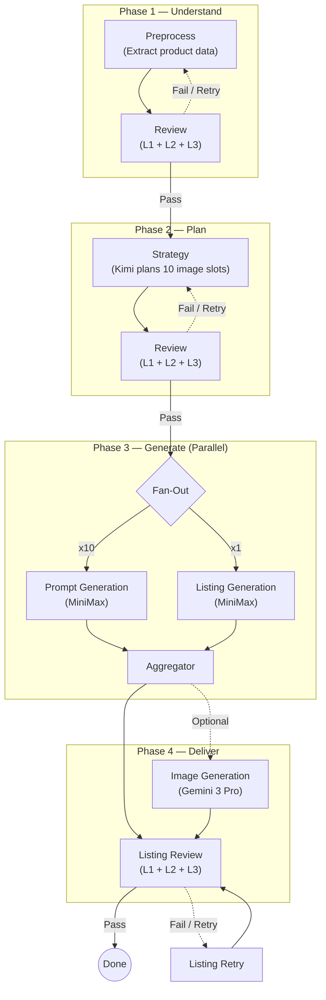

# Etsy Listing Agent

> AI-powered multi-agent system that transforms raw product photos into professional Etsy listings — complete with AI-generated product photography, optimized titles, tags, and descriptions.

`Multi-Agent Architecture` `Context Engineering` `LangGraph` `Fan-Out/Fan-In Parallelism` `Agentic Tool-Use Loops` `Multi-Model Routing` `Self-Correcting Agents` `Context Isolation` `Deterministic Validation` `LangSmith Observability`

<div align="center">


</div>

## Before & After

**Raw product photos** taken with a phone:

<p>
  
  
  
  
</p>

**AI-generated product photography** (4 of 10 images):

<p>
  
  
</p>
<p>
  
  
</p>

Given a few raw product photos and basic product info, the agent automatically:

- **Plans** a 10-image photography strategy (hero, model wearing, macro detail, flat lay, lifestyle scenes, packaging...)
- **Generates** professional product photography using AI
- **Writes** optimized Etsy listing copy (title, tags, description)
- **Validates** every output through a 3-layer review system

## Architecture



Each stage has its own review agent that performs 3-layer validation. If a review fails, the stage retries automatically (up to a configurable limit).

| Review Layer | What It Checks |
|---|---|
| **L1 — Schema** | JSON structure, required fields, type correctness |
| **L2 — Rules** | Business logic, value ranges, cross-field consistency |
| **L3 — Semantic** | AI-powered quality check (Claude) — tone, accuracy, completeness |

## Tech Stack

| Layer | Technology |
|---|---|
| **Orchestration** | LangGraph (multi-agent state machine with fan-out parallelism) |
| **Reasoning** | Kimi (strategy planning) + Claude (semantic review, multimodal preprocessing) |
| **Content Generation** | MiniMax M2.5 (prompts + listings — cost-optimized agentic calls) |
| **Image Generation** | Gemini 3 Pro (4K resolution, 10 directions per product) |
| **Backend** | FastAPI + SQLAlchemy + SQLite |
| **Frontend** | Next.js 15 + shadcn/ui + Tailwind CSS 4 |
| **Auth** | Google OAuth 2.0 |
| **Real-time Updates** | Server-Sent Events (SSE) |
| **Observability** | LangSmith tracing |

## Key Engineering Decisions

- **Why LangGraph, not Claude Code skills** — Nested skills broke under composition (step skipping, quality degradation, call blindness). LangGraph gives deterministic orchestration: explicit state machine, fan-out parallelism, review gates, and per-node model flexibility.
- **Workflow orchestration + agentic nodes** — The overall pipeline is a fixed state machine (guaranteed execution, explicit transitions). Inside each node, agents run custom multi-turn tool-use loops on the Anthropic Messages API — generating drafts, calling validation tools, and self-correcting. MiniMax exposes an Anthropic-compatible endpoint, so the same agentic loop works across providers without adapters.
- **Multi-model cost routing** — Claude Vision for preprocessing (only model that can see photos), Kimi for strategy reasoning (~1/10th Opus cost), MiniMax for prompt + listing generation (~1/10th Sonnet cost), Gemini for image rendering. The key insight: well-structured skills do the heavy lifting — a cheaper model following excellent instructions matches an expensive model with mediocre ones.
- **Context as organizational design** — Mirrors how human teams work: the Strategy Agent (marketing) creates a plan, each Prompt Agent (photographer) receives only its assigned slot brief — not the full strategy or other slots. Skills serve as SOPs. This is context isolation by design, not by accident.
- **When to split into multi-agent** — Four criteria: (1) context isolation — if agents don't need each other's context, separate them; (2) parallelism — 10 prompts run simultaneously, cutting time from ~10min to ~1min; (3) trackability — separate LangSmith traces per agent; (4) model flexibility — vision tasks need Claude, text generation works with MiniMax.
- **Deterministic validation before AI review** — L1 (schema) and L2 (rules) catch 90%+ of issues at $0 and <1ms. L3 (Claude semantic review) is reserved for quality judgment. The reviewer is context-isolated from the generator — it never sees generation instructions, preventing self-grading bias.

## Project Structure

```
etsy-listing-agent/
├── src/etsy_listing_agent/    # Core engine (LangGraph workflow)
│   ├── workflow.py            # Graph definition + fan-out routing
│   ├── nodes.py               # Agent nodes (preprocess, strategy, prompt, listing...)
│   ├── validators.py          # 3-layer validation (schema → rules → semantic)
│   ├── image_generator.py     # Gemini integration
│   └── config_loader.py       # Runtime config loader
├── backend/                   # FastAPI server
│   ├── app/api/               # REST + SSE endpoints
│   ├── app/auth/              # Google OAuth
│   └── app/services/          # Workflow runner
├── frontend/                  # Next.js dashboard
│   └── src/components/        # React components (image grid, prompt cards, pipeline view...)
├── config/                    # Proprietary prompts & rules (gitignored)
├── config.example/            # Config templates
├── skills/                    # Agent skill definitions (gitignored)
├── tests/                     # Engine tests (110 tests)
└── docs/                      # Technical articles
```

## Tests

```bash
# Engine tests (110 tests)
uv run pytest tests/ -v

# Backend tests (56 tests)
cd backend && uv run pytest tests/ -v

# Frontend build check
cd frontend && npx next build
```

## Article

- [Building an AI Product Photography Agent](docs/building-ai-product-photography-agent.md) — From Claude Desktop to production API: what I learned about context engineering, multi-agent architecture, and the real bottleneck in AI image generation.

---

Built with [Claude Code](https://claude.ai/claude-code)
